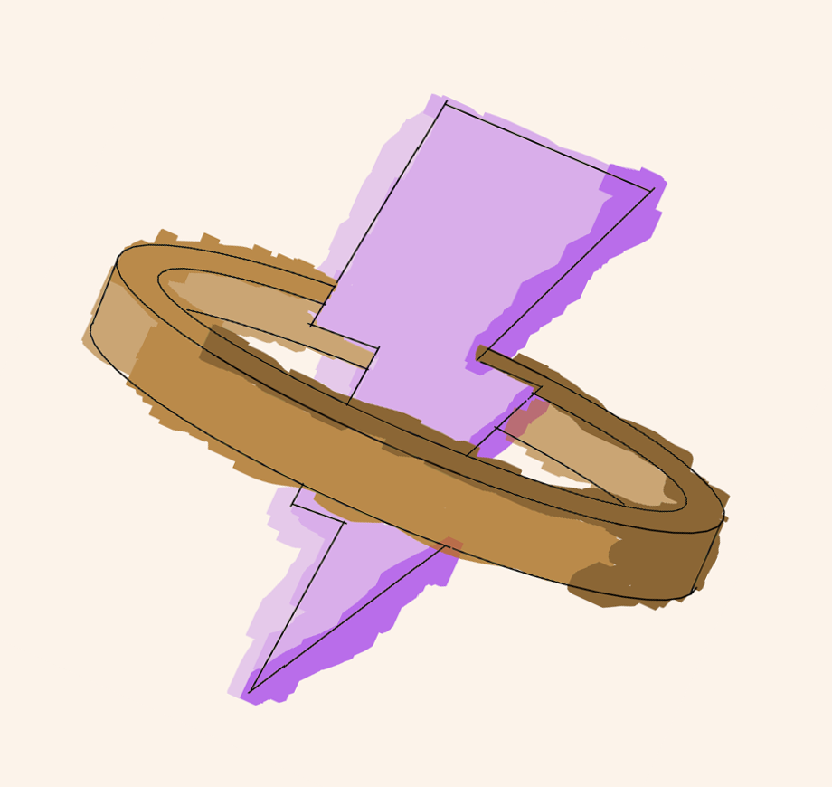

<!-- Improved compatibility of back to top link: See: https://github.com/othneildrew/Best-README-Template/pull/73 -->
<a id="readme-top"></a>

<!-- PROJECT SHIELDS -->
<!--
*** I'm using markdown "reference style" links for readability.
*** Reference links are enclosed in brackets [ ] instead of parentheses ( ).
*** See the bottom of this document for the declaration of the reference variables
*** for contributors-url, forks-url, etc. This is an optional, concise syntax you may use.
*** https://www.markdownguide.org/basic-syntax/#reference-style-links
-->
[![Contributors][contributors-shield]][contributors-url]
[![Forks][forks-shield]][forks-url]
[![Stargazers][stars-shield]][stars-url]
[![Issues][issues-shield]][issues-url]
[![MIT License][license-shield]][license-url]
[![LinkedIn][linkedin-shield]][linkedin-url]


<!-- PROJECT LOGO -->
<br />
<div align="center">
  <a href="https://github.com/JemmeCh/Flashy_Project/">
    
  </a>

<h3 align="center">PHY3030 - FLASHy Project</h3>

  <p align="center">
    Development and implementation of data acquisition and signal analysis for the experimental BCT detector and additional detectors using the CAEN DT5781 digitizer and the Bergoz ACCT Digital Electronics in the context of eFLASH therapy studies.
    <br />
    <a href="https://github.com/JemmeCh/Flashy_Project/"><strong>To Documentation »</strong></a>
    <br />
    <br />
    <a href="https://github.com/JemmeCh/Flashy_Project/">See Demo</a>
    ·
    <a href="https://github.com/JemmeCh/Flashy_Project/issues/new?labels=bug&template=bug-report---.md">Report Bug</a>
    ·
    <a href="https://github.com/JemmeCh/Flashy_Project/issues/new?labels=enhancement&template=feature-request---.md">Request Feature</a>
  </p>
</div>


<!-- TABLE OF CONTENTS -->
<details>
  <summary>Table of contents</summary>
  <ol>
    <li>
      <a href="#about-the-project">About the project</a>
      <ul>
        <li><a href="#built-with">Built with</a></li>
      </ul>
    </li>
    <li>
      <a href="#usage">Usage</a>
      <ul>
        <li><a href="#prerequisites">Prerequisites</a></li>
        <li><a href="#installation">Installation</a></li>
      </ul>
    </li>
    <li><a href="#roadmap">Roadmap</a></li>
    <li><a href="#contributing">Contributors</a></li>
    <li><a href="#license">License</a></li>
    <li><a href="#contact">Contact</a></li>
    <li><a href="#acknowledgments">Acknowledgments</a></li>
  </ol>
</details>


<!-- ABOUT THE PROJECT -->
## About the project

![FLASHy][product-screenshot]

Ultra-high dose rate radiotherapy, or **FLASH radiotherapy**, makes it possible to treat cancer by delivering very high doses of radiation within a few milliseconds. Current cancer treatments last several minutes, whereas FLASH radiotherapy, despite its extremely short exposure time, appears to be just as effective while also reducing damage to the healthy tissues surrounding the tumor(s). The CHUM is equipped with a FLASH radiotherapy device, the first of its kind in Canada, and our research group is responsible for developing new detectors compatible with this system.

This project first began in the fall of 2024 as part of an undergraduate project. The objective was to create software capable of analyzing data recorded by the detectors in order to verify that the radiation beam has the desired shape. The software must be able to interpret the received signals, analyze them, and generate graphs describing the detected beams.

Now, **FLASHy** is being developed into an extensible software platform capable of supporting multiple detector types, including the BCT and the **Flash MicroDiamond** detectors. It will also enable experimental beam monitoring with the BCT, representing a significant milestone toward the clinical implementation of this new treatment modality.


<p align="right">(<a href="#readme-top">Back to top</a>)</p>


### Built with
* [![NumPy][numpy]][numpy-url]
* [![PySide6][PySide6]][PySide6-url]
* [![https://avatars.githubusercontent.com/u/5440571?s=48&v=4][pyqtgraph]][pyqtgraph-url]
* [![nptdms][nptdms]][nptdms-url]
* [![msgspec-image][msgspec]][msgspec-url]
<p align="right">(<a href="#readme-top">Back to top</a>)</p>


<!-- GETTING STARTED --> 
## Usage
FLASHy is ment to be used mainly with the CAEN DT5781 digitizer, but other users are encouraged to add their own using FLASHy's flexible architecture (see <a href="#contributing">below</a>). Hence, this description of FLASHy's use is explain from the perspective of the `CAEN DT5781` tab. Its parameters are exposed to the user and can be changed while respecting the rules set in its documentation. 

The user can also select and assign different detectors to specific channels. Each detector has its own parameters used internally during analysis of the waveform. Waveforms can be compared visually in the common relative graph. Here is the list of implemented available detectors:

<details>
  <summary>Detectors</summary>
  <ol>
    <li>Bergoz BCT</li>
    <li>Flash Diamond (to be implemented)</li>
  </ol>
</details>

One can choose where acquired data is stored and the name of the _shoot_. After each acquisition, data is stored as a `TDMS` file which contain waveform data of each event seperated by channel. The root contains the parameters used during acquisition for future reference. Saved data can be reviewed directly in FLASHy's GUI interface under the `Analyser` tab. The user can then change how they want to analyse the acquired data and save their results using the button under the result table (_to be implemented_).

In the future, the `Bergoz ADE` will be used for experimental beam monitoring using the Bergoz ACCT Digital Electronics for beam synchronization and the BCT detector. 

### Prerequisites
FLASHy uses the CAEN FELib Python bind which requires CAEN FELib and the CAEN Dig1 implementation from their [website](https://www.caen.it/products/caen-felib-library/). They need to be installed for FLASHy to be able to use the CAEN DT5781 digitizer.

**As of now, FLASHy won't work if this library isn't installed.**

### Installation
1. Clone the repo
   ```sh
   git clone https://github.com/JemmeCh/Flashy_Project.git
   ```
3. Make virtual environnment and enter it
   ```sh
   python -m venv .venv
   # On Windows
   .\.venv\Scripts\activate
   ```
4. Install dependencies
   ```sh
   pip install -e ".[caen]"
   ```
5. Change git remote url to avoid accidental pushes to base project
   ```sh
   git remote set-url origin JemmeCh/Flashy_Project
   git remote -v # confirm the changes
   ```
6. Start FLASHy
   ```sh
   flashy
   ```
<p align="right">(<a href="#readme-top">Back to top</a>)</p>


<!-- ROADMAP -->
## Roadmap
<!-- Détail sur Affine  -->
### Primary
- [X] Flesh out how user can add new detectors
- [ ] Add Flash Diamond detector parameters
- [ ] Implement detector assignment and channel usage
- [ ] Implement using FLASHy without installing CAEN FELIB and CAEN Dig1
- [ ] Flesh out how user can add new tabs
- [ ] Implement ADE tab
- [X] Make proper UserConfig model

### Secondary
- [ ] Revamp error handling
- [X] Logo for FLASHy
- [ ] Themes and application parameters
- [ ] Add back "Tutoriel" (integrated documentation) and "About" menu bar menues 

See the [open issues](https://github.com/JemmeCh/Flashy_Project/issues) for a full list of proposed features (and known issues).

<p align="right">(<a href="#readme-top">Back to top</a>)</p>


<!-- CONTRIBUTING --> 
## Contributing
<a id="contributing"></a>
Contributions are what make the open source community such an amazing place to learn, inspire, and create. Any contributions you make are **greatly appreciated** and we are open to collaborating with other medical physics research groups.

If you have a suggestion that would make this better, please fork the repo and create a pull request. You can also simply open an issue with the tag "enhancement".

1. Fork the Project
2. Create your Feature Branch (`git checkout -b feature/AmazingFeature`)
3. Commit your Changes (`git commit -m 'Add some AmazingFeature'`)
4. Push to the Branch (`git push origin feature/AmazingFeature`)
5. Open a Pull Request
<p align="right">(<a href="#readme-top">Back to top</a>)</p>


### Top Contributors:

<a href="https://github.com/JemmeCh/Flashy_Project/graphs/contributors">
  
</a>


<!-- LICENSE -->
## License
Distributed under the MIT License. See `LICENSE.md` for more information.
<p align="right">(<a href="#readme-top">Back to top</a>)</p>


<!-- CONTACT -->
## Contact
<!-- 
Your Name - [@twitter_handle](https://twitter.com/twitter_handle) - email@email_client.com
-->
Link to project: [https://github.com/JemmeCh/Flashy_Project](https://github.com/JemmeCh/Flashy_Project)

<p align="right">(<a href="#readme-top">Back to top</a>)</p>


<!-- ACKNOWLEDGMENTS -->
## Acknowledgments

* [Arthur Lalonde, my PI](https://recherche.umontreal.ca/english/our-researchers/professors-directory/researcher/is/in29955/)
* [Nicole St-Louis, PHY3030's class professor](https://recherche.umontreal.ca/english/our-researchers/professors-directory/researcher/is/in15156/)
* [Bergoz Instrument](https://www.bergoz.com/)
* [CAEN](https://caen.it/)
* [Arnaud Lessard, for helping me with NumPy](https://www.facebook.com/profile.php?id=100009397104882)
* [Readme.md template](https://github.com/othneildrew/Best-README-Template)

![Everyone in my lab][lab]

<p align="right">(<a href="#readme-top">Back to top</a>)</p>


<!-- AI -->
## Use of LLM (Large Language Models)

LLMs, said "artificial intelligence", were used to help during the brainstorming of FLASHy's new core architecture (Version >1.0.3) and with maintaining the chosen MVP (Model-View-Presenter) standard throughout the project. They helped in finding potential reasons for unwanted bugs, such as finding sources of race conditions.

They weren't used to generate large chunks and writing code. 

<!-- MARKDOWN LINKS & IMAGES -->
<!-- https://www.markdownguide.org/basic-syntax/#reference-style-links -->
[numpy]: https://img.shields.io/badge/mlflow-%23d9ead3.svg?style=for-the-badge&logo=numpy&logoColor=blue
[numpy-url]: https://numpy.org/
[tkinter-url]: https://docs.python.org/3/library/tkinter.html
[pyside6]: https://img.shields.io/badge/Qt-PySide6-48c557?style=flat&logo=qt
[pyside6-url]: https://pypi.org/project/PySide6/
[nptdms]: https://img.shields.io/badge/NI-nptdms-03b584?style=flat&logo=python
[nptdms-url]: https://pypi.org/project/npTDMS/
[pyqtgraph]: https://img.shields.io/badge/Qt-PyQtGraph-48c557?style=flat&logo=qt
[pyqtgraph-url]: https://github.com/pyqtgraph/pyqtgraph
[msgspec]: https://img.shields.io/badge/Python-msgspec-7484d3?style=flat&logo=python
[msgspec-logo]: https://msgspec.dev/_static/msgspec-logo-light.svg
[msgspec-url]: https://github.com/msgspec/msgspec

[contributors-shield]: https://img.shields.io/github/contributors/JemmeCh/Flashy_Project.svg?style=for-the-badge
[contributors-url]: https://github.com/JemmeCh/Flashy_Project/graphs/contributors
[forks-shield]: https://img.shields.io/github/forks/JemmeCh/Flashy_Project.svg?style=for-the-badge
[forks-url]: https://github.com/JemmeCh/Flashy_Project/network/members
[stars-shield]: https://img.shields.io/github/stars/JemmeCh/Flashy_Project.svg?style=for-the-badge
[stars-url]: https://github.com/JemmeCh/Flashy_Project/stargazers
[issues-shield]: https://img.shields.io/github/issues/JemmeCh/Flashy_Project.svg?style=for-the-badge
[issues-url]: https://github.com/JemmeCh/Flashy_Project/issues
[license-shield]: https://img.shields.io/github/license/JemmeCh/Flashy_Project.svg?style=for-the-badge
[license-url]: https://github.com/JemmeCh/Flashy_Project/blob/main/LICENSE.md
[linkedin-shield]: https://img.shields.io/badge/-LinkedIn-black.svg?style=for-the-badge&logo=linkedin&colorB=555
[linkedin-url]: https://linkedin.com/in/jean-emmanuel-chouinard/
[product-screenshot]: readme-images/FLASHy_1-8-0_Analyser.png
[lab]: readme-images/lab-E2026.jpg